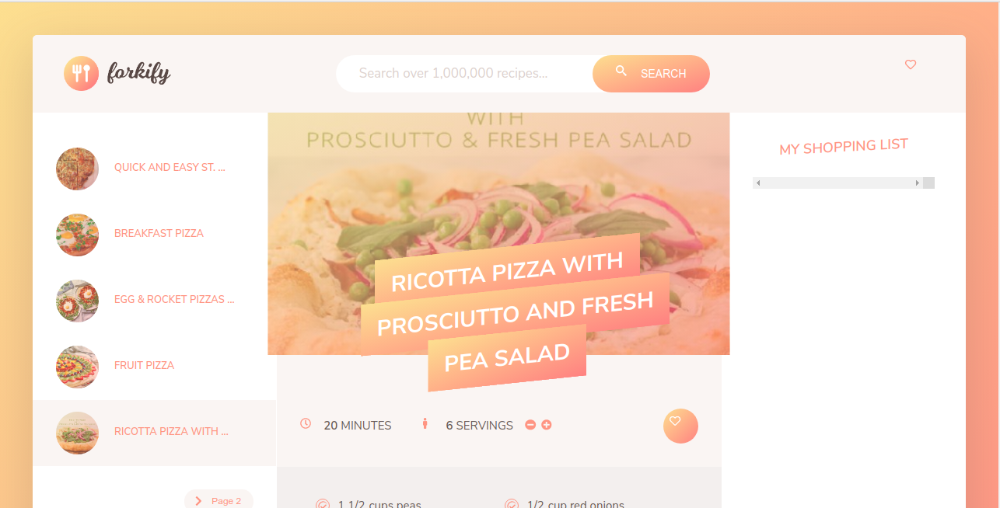

# Restaurant-page

> This project is an API project. You can search recipes and get details of them. I used spoonacular API for this project.

This project has this characteristics:
  - Webpack and npm packages implementation
  - spoonacular API.
  - AXIOS API call.
## Built With

- HTML, CSS
- Javascript
- Local storage

## Live Demo

[Live Demo Link](https://github.com/sumancrest0001/recipe-API)

## Author

👤 **Suman Shrestha**

- Github: [@sumancrest0001](https://github.com/sumancrest0001)

- LinkedIn: [Suman Shrestha](https://www.linkedin.com/in/suman-shrestha0001/)

- Email: suman.crest0001@gmail.com

## 🤝 Contributing

Contributions, issues and feature requests are welcome!

Feel free to check the [issues page](https://github.com/sumancrest0001/recipe-API/issues).

## Show your support